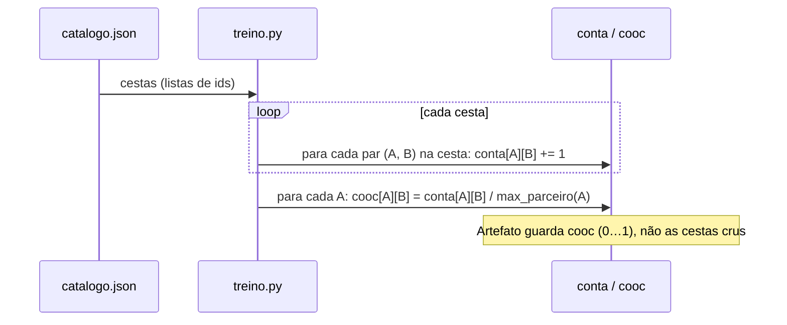
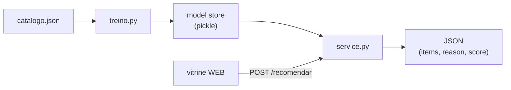
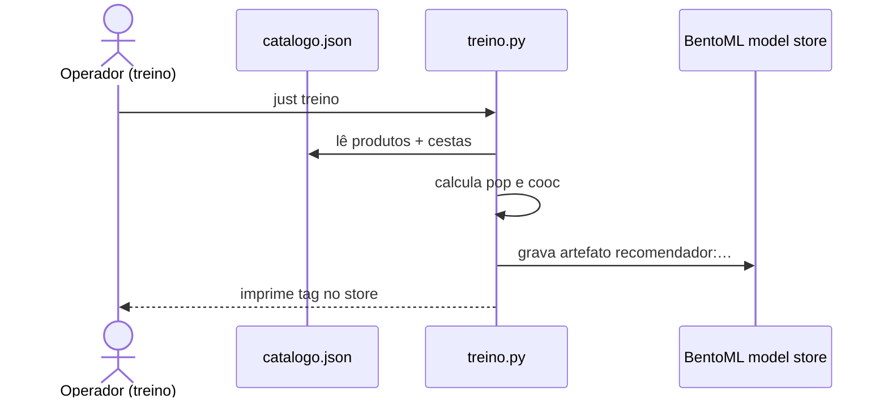
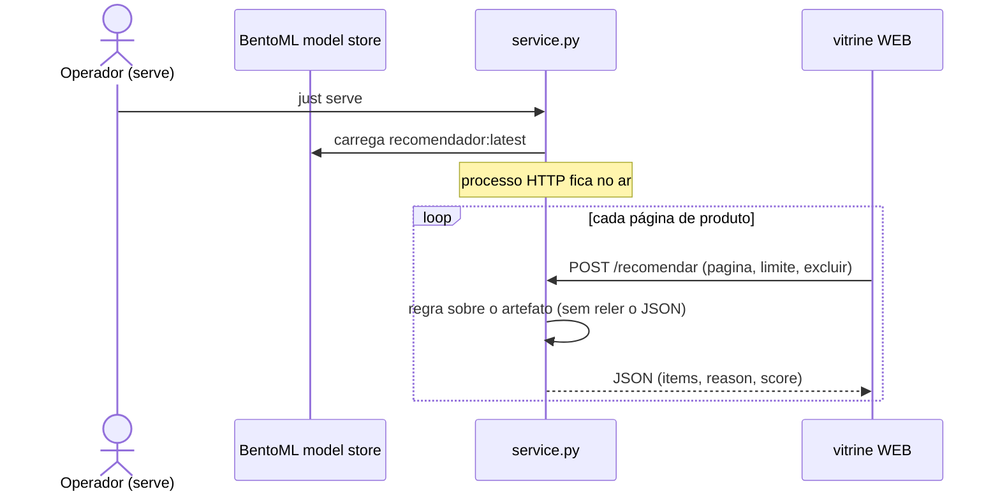
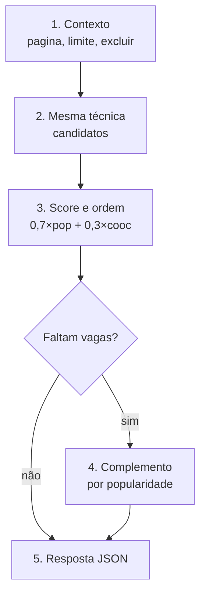
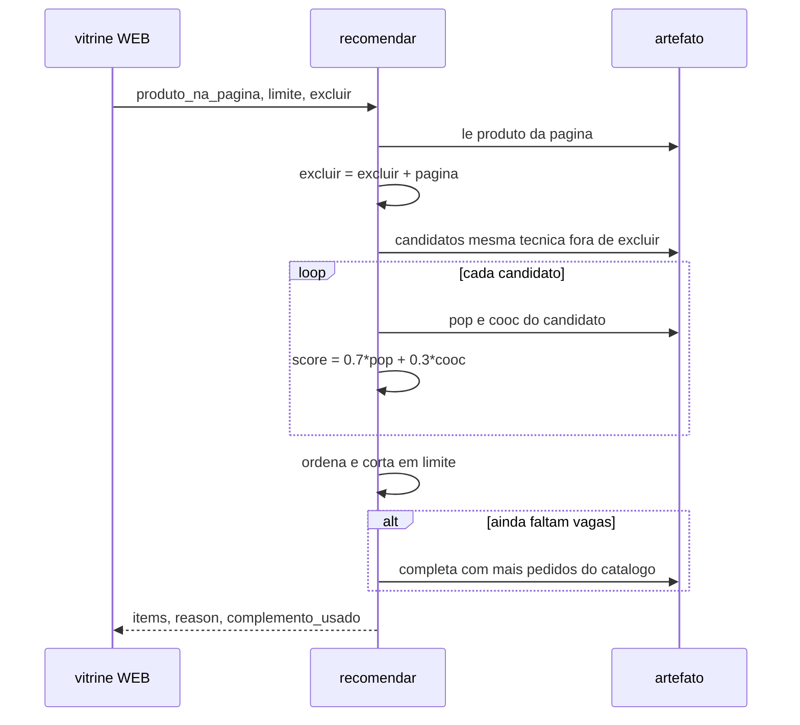

# Recomendador no BentoML

Imagine uma feira de artesanato na internet. Tem jarro de barro, renda, xilogravura,
cesto de palha. A pessoa abre a página de um jarro de Tracunhaém. Embaixo da foto,
aparecem outras peças: um prato da mesma técnica, uma boneca de barro, e mais duas
sugestões que muita gente já pediu. Ninguém digitou “cerâmica” na busca. A loja
simplesmente **chutou com cuidado** o que ainda pode interessar.

Esse “chute com cuidado” é o **sistema de recomendação**. Sem ele, a pessoa só vê o
que ela mesma procura — e a maior parte do catálogo fica invisível. Com ele, a loja
usa o produto da página (e, neste material, o histórico de pedidos de exemplo) para
montar uma lista curta de **outros** produtos. Não é um chatbot: não conversa. Não é
um classificador genérico: não rotula texto. É um ranqueador: recebe um produto e
devolve outros, cada um com uma nota e um motivo legível.

Este repositório traz um catálogo pequeno de
peças pernambucanas, um treino que calcula popularidade e “aparecem juntos”, e um
serviço HTTP no BentoML que responde a essas sugestões. Você sobe com dois comandos,
confere no Swagger ou no `curl`, e depois lê as contas no caderno e nos slides.

## Variantes

Pastas irmãs do baseline — cada uma com artefato BentoML e porta HTTP próprios:

| Pasta | Sinal extra | Porta | Artefato |
| --- | --- | --- | --- |
| [`variante-demografica/`](variante-demografica/) | perfil do cliente + compras por faixa etária | 3001 | `recomendador-demo` |
| [`variante-clustering/`](variante-clustering/) | cluster hierárquico + lista intercalada cesta/cluster | 3002 | `recomendador-cluster` |

## Cesta de compra

Numa loja real, uma **cesta** (ou carrinho fechado) é o conjunto de produtos que a
pessoa levou **na mesma compra**. Se alguém pediu jarro + prato + boneca juntos,
esses três ids formam uma cesta. O recomendador usa isso para aprender
“aparecem juntos”: produtos que compartilham cestas tendem a se reforçar na nota
de **co-ocorrência**.

Neste material as cestas são **exemplos sintéticos** (não tickets de loja real).
Elas vivem em [`dados/catalogo.json`](dados/catalogo.json), no array `cestas`:
cada elemento é uma lista de ids de produto.

```json
"cestas": [
  ["p01", "p02", "p03"],
  ["p01", "p02"],
  ["p04", "p05", "p06"]
]
```

A primeira linha lê-se: “numa compra de exemplo saíram `p01`, `p02` e `p03`
juntos”. Ordem dentro da lista não importa para o treino; o que importa é o
**par** (a, b) aparecer na mesma cesta. O catálogo de itens (nome, técnica,
região, **`pedidos`**) fica no array irmão `produtos` — detalhes em
[`dados/README.md`](dados/README.md).

## Popularidade e co-ocorrência

Dois números que o treino tira do JSON e que o serviço usa na nota. Ambos acabam
em escala **0…1**, para poderem entrar na mesma fórmula de score. Vêm de **chaves
diferentes** do mesmo arquivo:

| Sinal | Array / campo no JSON | O que mede |
| --- | --- | --- |
| Popularidade | `produtos[].pedidos` | Quão pedido é o item (contagem por produto) |
| Co-ocorrência | `cestas` | Quão frequentemente dois ids saem **na mesma** compra |

Não misture: contar em quantas cestas um id aparece **não** é o que este baseline
faz para popularidade. Aqui a demanda já veio agregada no campo `pedidos` de cada
produto; as `cestas` servem só para pares.

### Popularidade

**Popularidade** é quão pedido é cada produto. No dataset isso é o campo `pedidos`
dentro de cada objeto de `produtos` — por exemplo `"pedidos": 42` no jarro `p01`.
Não lemos `cestas` neste passo. No treino copiamos esses valores para um mapa
`pedidos_brutos` e viramos um número entre 0 e 1 (`pop`) dividindo pelo maior
`pedidos` do catálogo — o item mais pedido fica em 1,0; os outros ficam abaixo.

Pseudocódigo a partir do JSON (`produtos` apenas):

```text
# Variáveis:
#   catalogo       — objeto JSON raiz (lido de catalogo.json)
#   produtos       — lista catalogo["produtos"]
#   p              — um registro {id, nome, tecnica, regiao, pedidos}
#   pedidos_brutos — mapa id → pedidos crus (número)
#   max_pedidos    — maior valor em pedidos_brutos
#   pop            — mapa id → popularidade normalizada em 0…1
#   id             — chave de produto

produtos ← catalogo["produtos"]

para cada p em produtos:
    pedidos_brutos[p.id] ← p.pedidos     # campo pedidos; não vem de cestas

max_pedidos ← máximo dos valores em pedidos_brutos
para cada id:
    pop[id] ← pedidos_brutos[id] / max_pedidos
```

No Python (`treino.py`, função `main`) os nomes batem com o pseudocódigo:

| Pseudocódigo | Código |
| --- | --- |
| `catalogo` | `catalogo = json.loads(…)` |
| Ler `produtos` | `produtos = {p["id"]: p for p in catalogo["produtos"]}` |
| `pedidos_brutos` | `pedidos_brutos = {pid: float(p["pedidos"]) for …}` |
| `max_pedidos` | `max_pedidos = max(pedidos_brutos.values()) or 1.0` |
| `pop[id]` | `pop = {pid: n / max_pedidos for …}` |

O artefato guarda **os dois**: `pedidos_brutos` (cru) e `pop` (0…1). O serviço
usa `pop` no score.

### Co-ocorrência

**Co-ocorrência** mede, para cada produto A, quão frequentemente outro produto B
sai **na mesma cesta** de exemplo (a mesma compra fictícia do dataset). Neste passo
usamos só o array `cestas` — o campo `pedidos` não entra.

Como contamos: se uma cesta traz `[p01, p02, p03]`, registramos que `p01` apareceu
com `p02` e com `p03`, que `p02` apareceu com `p01` e `p03`, e assim por diante
(o par é simétrico). No fim, para cada produto A, dividimos essas contagens pelo
parceiro que mais apareceu junto com A. O resultado fica entre 0 e 1: o parceiro
mais comum de A vale 1,0; os outros ficam abaixo.

Isso **não** olha a técnica artesanal. Dois produtos podem sair juntos muitas vezes
e ter técnicas diferentes; ou ser da mesma técnica e nunca terem saído na mesma
cesta. A técnica é um filtro **à parte**, aplicado depois em `service.py`, quando
a vitrine já pediu recomendações para o produto da página.



Pseudocódigo a partir do JSON:

```text
# Variáveis:
#   catalogo — objeto JSON raiz
#   cestas   — lista catalogo["cestas"] (cada item = lista de ids)
#   cesta    — uma compra de exemplo (lista de ids)
#   ids      — ids únicos dentro de uma cesta
#   a, b     — dois ids distintos formando um par
#   conta    — mapa produto_ref → (vizinho → contagem bruta)
#   m        — máximo de conta[a][*] para o produto de referência a
#   cooc     — mapa produto_ref → (vizinho → co-ocorrência em 0…1)

cestas ← catalogo["cestas"]

# contagem bruta de pares (simétrica)
para cada cesta em cestas:
    ids ← únicos na cesta
    para cada par ordenado (a, b) com a ≠ b entre ids:
        conta[a][b] ← conta[a][b] + 1
        conta[b][a] ← conta[b][a] + 1

# normalização por produto de referência (cada linha do mapa)
para cada produto de referência a:
    m ← máximo de conta[a][*]
    para cada vizinho b:
        cooc[a][b] ← conta[a][b] / m
```

No Python isso é a função `_cooc` + a chamada em `main`:

| Pseudocódigo | Código |
| --- | --- |
| Percorrer `cestas` | `for cesta in cestas:` |
| `ids` (únicos) | `ids = list(dict.fromkeys(cesta))` |
| `conta[a][b]` | `conta[a][b] += 1.0` e `conta[b][a] += 1.0` |
| `cooc[a][b]` | `cooc[a] = {b: v / m for b, v in vizinhos.items()}` |
| Guardar no artefato | `cooc = _cooc(catalogo["cestas"])` |

No artefato o mapa se chama `cooc`: `cooc[pagina][candidato]` é a co-ocorrência
normalizada do candidato dado o produto da página (0 se nunca apareceram juntos).

## Workflow

Dois momentos distintos — e, em MLOps, dois **papéis** distintos. Não misture na
mesma sequência: quem treina não é quem clica na vitrine.

| Momento | Em MLOps | Neste repo | Quem age | Frequência |
| --- | --- | --- | --- | --- |
| **Treino** (offline) | *training* / *batch* — a partir dos dados, produz um artefato | `just treino` → `treino.py` | Operador (você na aula, CI/CD ou job agendado em produção) | Rara: quando o catálogo ou a regra mudam |
| **Inferência** (online) | *inference* / *serving* — aplica o artefato a um pedido novo | `just serve` → `POST /recomendar` | A vitrine (cliente HTTP); o serviço só responde | A cada página de produto |

**Treino** lê o histórico (aqui: `catalogo.json`), calcula `pop` e `cooc`, e **grava**
o pickle no model store (`recomendador:…`). Sem esse passo, o serviço não tem o que
carregar.

**Inferência** sobe o HTTP uma vez (`just serve`), carrega `recomendador:latest`, e
em cada clique aplica a regra já pronta — **não** relê o JSON nem recalcula o
catálogo. A saída é JSON para a WEB desenhar a faixa de sugestões.

No mapa de dependências (ainda juntos, só para ver a seta do artefato):



### Sequência 1 — só o treino (offline)

Aqui o ator é quem prepara o artefato. A vitrine **não** aparece.



### Sequência 2 — só a inferência (online)

Outro momento, outros atores: sobe o serviço (ainda o operador, uma vez) e depois
só a vitrine conversa com a API. O treino **não** roda de novo a cada clique.



Mudou o JSON? Isso é de novo **treino**: rode `just treino` e reinicie o serve (ou
deixe o `--reload` pegar a tag `latest`). Enquanto o catálogo não muda, só a
sequência 2 se repete.

## Visão geral do algoritmo

O fluxo cabe em cinco passos, na ordem em que o serviço decide a lista:



O mesmo caminho, como troca de mensagens dentro de **um** pedido:




1. **Contexto.** A vitrine manda o id do produto aberto (`produto_na_pagina`), quantas
   sugestões quer (`limite`) e ids a omitir (`excluir`). O próprio produto da página
   entra automaticamente na lista de omitidos.
2. **Mesma técnica.** Entre os demais itens do catálogo, ficam só os que têm a mesma
   `tecnica` artesanal (por exemplo, todos de *ceramica* se a página é um jarro de barro).
3. **Nota e ordem nesse grupo.** Cada candidato recebe
   $`\mathrm{score} = 0.7 \times \mathrm{pop} + 0.3 \times \mathrm{cooc}`$.
   A popularidade vem dos `pedidos` normalizados; a co-ocorrência mede quantas vezes
   dois produtos apareceram juntos nas cestas de exemplo do dataset. Ordenamos do maior
   score para o menor e pegamos até `limite` itens. O motivo gravado é `mesma_tecnica`.

   **Por que essa fórmula?** Mistura dois sinais: “muita gente pede isso” (popularidade)
   e “costuma sair junto com o produto da página” (co-ocorrência). O peso **0,7 / 0,3**
   privilegia a demanda geral dentro da mesma técnica, sem ignorar o histórico das
   cestas. Os pesos ficam em `service.py` — dá para trocá-los e comparar o JSON.

   **O que é “normalizado”?** Os `pedidos` brutos são contagens (8, 28, 42…). Se
   somássemos pedidos crus com co-ocorrência (que já está em 0…1), o número grande
   dominaria a nota. Normalizar aqui significa **dividir pelo máximo do catálogo**:


$$
\mathrm{pop}_i = \frac{\mathrm{pedidos}_i}{\max_j \mathrm{pedidos}_j}
$$

   Assim a popularidade também fica entre 0 e 1 (o jarro com 42 pedidos vira 1,0; quem
   tem 21 vira 0,5). A co-ocorrência já nasce normalizada **por produto de referência**:
   para o produto da página, contamos quantas vezes cada vizinho saiu na mesma cesta e
   dividimos pelo vizinho mais frequente daquele produto.

   Pseudocódigo (mesmo grupo, após filtrar técnica e exclusões):

   ```text
   # Variáveis:
   #   produtos   — mapa id → registro (já no artefato)
   #   pop        — mapa id → popularidade 0…1 (artefato.pop)
   #   cooc       — mapa produto_ref → (vizinho → 0…1) (artefato.cooc)
   #   pagina     — id do produto_na_pagina
   #   excluir    — conjunto de ids a omitir (mais a própria pagina)
   #   candidatos — lista de ids mesma tecnica, fora de excluir
   #   c          — um id candidato
   #   score      — mapa id → nota composta
   #   limite     — quantos itens devolver
   #   escolhidos — lista final ordenada (até limite)

   # pop e cooc já vêm do artefato; aqui só a montagem da lista:
   candidatos ← produtos com mesma tecnica que pagina
                e id ∉ excluir ∪ {pagina}

   para cada c em candidatos:
       score[c] ← 0.7 * pop[c] + 0.3 * cooc[pagina].get(c, 0)

   ordenar candidatos por score decrescente
   escolhidos ← primeiros limite de candidatos
   # reason ← "mesma_tecnica"
   ```
4. **Complemento por popularidade.** Se ainda faltarem vagas (poucos produtos daquela
   técnica), completamos com os mais pedidos do catálogo inteiro, ainda respeitando
   `excluir`. Nesses, $`\mathrm{score} = 0.5 \times \mathrm{pop}`$ e o motivo é
   `complemento_popularidade`. O campo `complemento_usado` fica `true`.
5. **Resposta.** Devolvemos a lista com id, nome, técnica, região, score, motivo e rank —
   pronta para a WEB desenhar a faixa “Você também pode gostar”.

Não há rede neural nem modelo de linguagem neste baseline: são contagens e uma regra
fixa, auditáveis no papel (ver [`material/calculos-trabalhados.md`](material/calculos-trabalhados.md)).
O dataset e o significado de cada campo estão em [`dados/README.md`](dados/README.md).

---

## O que a API espera e o que ela devolve

O serviço escuta em `http://127.0.0.1:3000` depois de `just serve`. O endpoint útil
para a vitrine é:

```http
POST /recomendar
Content-Type: application/json
```

### Entrada

| Campo | Tipo | Exemplo | Significado |
| --- | --- | --- | --- |
| `produto_na_pagina` | string | `"p01"` | Id do produto aberto na tela (obrigatório) |
| `limite` | inteiro | `4` | Quantos produtos sugerir (padrão 4) |
| `excluir` | lista de strings | `[]` | Ids que não devem voltar (já vistos, já no carrinho, etc.) |

O próprio `produto_na_pagina` **nunca** entra na lista de saída: a loja não recomenda
o item que a pessoa já está olhando.

### Saída (sucesso)

JSON com:

| Campo | Significado |
| --- | --- |
| `items` | Lista ordenada de sugestões |
| `items[].product_id` | Id no catálogo |
| `items[].nome` | Nome legível |
| `items[].tecnica` | Técnica artesanal (ceramica, renda, …) |
| `items[].regiao` | Polo / região |
| `items[].score` | Nota numérica usada na ordenação |
| `items[].reason` | Motivo: `mesma_tecnica` ou `complemento_popularidade` |
| `items[].rank` | Posição 1…N |
| `strategy` | Nome da estratégia gravada no treino |
| `complemento_usado` | `true` se faltaram candidatos da mesma técnica e a lista foi completada com popularidade geral |
| `produto_na_pagina` | Eco do produto de contexto (id, nome, técnica, região) |
| `modelo` | Tag do artefato no store do BentoML |

### Saída (produto inexistente)

Se o id não estiver no catálogo:

```json
{
  "erro": "produto_inexistente",
  "produto_na_pagina": "nao-existe",
  "items": []
}
```

---

## Como subir e o que esperar nos testes

Pré-requisitos: [uv](https://docs.astral.sh/uv/) e [just](https://github.com/casey/just).
Nesta pasta:

```bash
just treino    # lê dados/catalogo.json, grava o modelo no store do BentoML
just serve     # sobe o serviço (deixe este terminal aberto)
```

Em outro terminal, ou pela UI em <http://127.0.0.1:3000>:

### Exemplo 1 — página do jarro (`p01`), quatro sugestões

É o caso trabalhado em [`material/calculos-trabalhados.md`](material/calculos-trabalhados.md).

```bash
just curl-exemplo
```

Corpo enviado:

```json
{"produto_na_pagina": "p01", "limite": 4, "excluir": []}
```

Resultado esperado (ordem e motivos):

| rank | produto | reason | score (aprox.) |
| ---: | --- | --- | ---: |
| 1 | Prato esmaltado Tracunhaém (`p02`) | `mesma_tecnica` | ≈ 0,77 |
| 2 | Boneca de barro (`p03`) | `mesma_tecnica` | ≈ 0,52 |
| 3 | Rendeira Alto do Moura (`p04`) | `complemento_popularidade` | ≈ 0,42 |
| 4 | Xilogravura Pilar (`p07`) | `complemento_popularidade` | ≈ 0,37 |

`complemento_usado` deve ser **true**: só existem duas outras cerâmicas no catálogo,
então as duas últimas vagas vêm dos mais pedidos do catálogo inteiro.

### Exemplo 2 — forçar o complemento (pouca mesma técnica)

```bash
just curl-complemento
```

Corpo:

```json
{"produto_na_pagina": "p12", "limite": 4, "excluir": ["p10", "p11"]}
```

Aqui o produto da página é o sousplat de palha (`p12`, cestaria). Excluímos os outros
dois de cestaria (`p10`, `p11`). Sobram **zero** candidatos da mesma técnica → a lista
inteira tende a ser preenchida por popularidade geral (`reason` =
`complemento_popularidade`, `complemento_usado`: true).

### Exemplo 3 — id que não existe

```bash
just curl-inexistente
```

Deve devolver `erro: "produto_inexistente"` e `items` vazio, sem inventar produtos.

---

## Mergulho técnico

### Ideia da regra (baseline, sem rede neural)

1. **Popularidade.** Cada produto tem um contador `pedidos` no JSON. No treino,
   normalizamos pelo máximo do catálogo:


$$
\mathrm{pop}_i = \frac{\mathrm{pedidos}_i}{\max_j \mathrm{pedidos}_j}
$$

2. **Co-ocorrência.** Nas cestas de exemplo, contamos quantas vezes dois produtos
   saem juntos; para cada produto de referência, normalizamos pelo vizinho mais
   frequente daquele produto.
3. **Candidatos.** Todos os produtos com a **mesma técnica** do item da página,
   exceto ele próprio e os ids em `excluir`.
4. **Ordenação (mesma técnica).**
   $`\mathrm{score} = 0.7 \cdot \mathrm{pop} + 0.3 \cdot \mathrm{cooc}`$.
5. **Complemento.** Se a lista ainda for menor que `limite`, completamos com os
   produtos de maior `pedidos` no catálogo (mesmo filtro de exclusão). Para esses,
   $`\mathrm{score} = 0.5 \cdot \mathrm{pop}`$.

O campo `regiao` vai no JSON de saída (a vitrine pode exibir), mas **esta versão
não usa região na ordenação**.

### Mapa de arquivos

| Arquivo | Papel |
| --- | --- |
| [`dados/catalogo.json`](dados/catalogo.json) | 12 produtos + cestas de exemplo |
| [`treino.py`](treino.py) | Calcula popularidade e co-ocorrência; grava pickle no model store (`recomendador:…`) |
| [`service.py`](service.py) | Classe BentoML `Recomendador`; API `recomendar` |
| [`bentofile.yaml`](bentofile.yaml) | Empacote opcional (`bentoml build`) |
| [`justfile`](justfile) | Atalhos `treino`, `serve`, curls |
| [`material/calculos-trabalhados.md`](material/calculos-trabalhados.md) | Contas do exemplo `p01` no papel |
| [`slides/recomendador-bentoml.pptx`](slides/recomendador-bentoml.pptx) | Slides da aula |
| [`scripts/gerar_slides.py`](scripts/gerar_slides.py) | Regenera o `.pptx` (`just slides`) |
| [`variante-demografica/`](variante-demografica/) | Variante com `clientes` + `compras` e score demográfico |
| [`variante-clustering/`](variante-clustering/) | Cluster hierárquico + intercalação `cesta` / `cluster` |

### Dependências e ambiente

- Python **≥ 3.13**, gerenciado por **uv** (`pyproject.toml` / `uv.lock`).
- Dependência de runtime: **BentoML**.
- Grupo `dev`: **python-pptx** (só para gerar slides).
- Comandos passam por `uv run …` (via `just`), com venv local nesta pasta.

### Ciclo treino → serve

`treino.py` lê o JSON, monta um dicionário Python e o serializa com `pickle` dentro
de um modelo BentoML chamado `recomendador`. `service.py` faz
`bentoml.models.get("recomendador:latest")` e carrega esse artefato na subida do
serviço. Mudou o catálogo? Rode `just treino` de novo e reinicie (ou confie no
`--reload` do `just serve`).

### O que este material não é

Não é aprendizado profundo, não é filtragem colaborativa com matriz de usuários
reais, não autentica, não persiste log de impressões, não avalia Precision@k.
É um **baseline** com técnica, popularidade, exclusões, JSON e motivo legível —
servido como API para a WEB consumir.

### Para onde ir depois (fora deste repositório)

1. Ligar `POST /recomendar` à vitrine do marketplace da disciplina.
2. Incluir região (ou popularidade por polo) na ordenação, se o requisito exigir.
3. Trocar a regra por um modelo de aprendizado de máquina — mapa concreto no fim
   deste README ([Do Data Science à Machine Learning](#ds-para-ml-microsoft-learn)),
   ancorado em
   [Fundamentos do aprendizado de máquina](https://learn.microsoft.com/pt-br/training/modules/fundamentals-machine-learning/)
   (Microsoft Learn, pt-BR).

Nada disso é necessário para este pacote rodar sozinho.

### Licença

**GPL-3.0** — ver [`LICENSE`](LICENSE).

BentoML (Apache-2.0) e python-pptx (MIT) têm licenças próprias; elas não alteram a
licença deste código.

---

No fim das contas, um marketplace precisa de recomendação pela mesma razão que a
feira física coloca peças parecidas na mesma banca: a pessoa já mostrou um interesse
(abriu um jarro) e a loja responde com vizinhança útil, sem obrigá-la a adivinhar o
vocabulário do catálogo. Este projeto deixa essa ideia pequena, auditável e no ar —
você vê o JSON, confere as contas no caderno e entende cada `reason`. O contrato HTTP
e a lógica de baseline estão prontos para a vitrine consumir e, se quiser, evoluir.

## Nomes neste repo e na literatura de recomendação

Os nomes da esquerda são os deste projeto. Os da direita são aproximações úteis ao
ler livros e artigos de *recommender systems*.

| Neste repo | Na literatura (aprox.) |
| --- | --- |
| `pop` / `pedidos_brutos` | *popularity baseline* (não personalizado) |
| `cooc` / `cestas` | co-ocorrência item–item; sinal de associação |
| filtro por `tecnica` | filtragem baseada em conteúdo (atributo do item) |
| score `0,7×pop + 0,3×cooc` | combinação híbrida ponderada (regra fixa) |
| complemento por popularidade | *fallback* / preenchimento por cobertura |
| `reason` no JSON | explicabilidade por regra |
| artefato + `POST /recomendar` | *offline compute* + *online inference* |

Este baseline é **ciência de dados + serviço**: agregamos contagens, aplicamos uma
fórmula e servimos JSON. Ainda **não** é aprendizado de máquina no sentido do
módulo Microsoft Learn abaixo (não há rótulo supervisionado, divisão treino/validação
nem métrica de erro do preditor).

## Do Data Science à Machine Learning (Microsoft Learn)

<a id="ds-para-ml-microsoft-learn"></a>

Módulo de referência:
[Introdução aos conceitos de Machine Learning](https://learn.microsoft.com/pt-br/training/modules/fundamentals-machine-learning/)
(11 unidades). A própria introdução do módulo diz que ML fica na interseção de
**ciência de dados** e **engenharia de software**: dados do passado → modelo
preditivo → *inferência* dentro de um serviço. Este repositório já cobre o lado
“serviço” (BentoML) e o lado “explorar/agregar dados”; falta o miolo preditivo.

### O que muda na formulação

| Hoje (regra) | Amanhã (ML) |
| --- | --- |
| Candidatos + fórmula fixa | Observações com **recursos** (features) e **rótulo** (label) |
| Um pickle de mapas | Artefato de modelo (ex.: scikit-learn) com parâmetros aprendidos |
| Sem métrica de acerto | Treino / validação + MAE, acurácia, Precision@k, etc. |
| `reason` = nome da regra | `reason` pode citar modelo + top features (ou continuar a regra como baseline A/B) |

Um caminho natural para recomendação: cada linha de treino é um par
`(pagina, candidato)` (e, se houver log, o usuário/sessão). O rótulo pode ser
“foi clicado / foi comprado / apareceu na mesma cesta” (binário) ou um score de
engajamento (regressão). Na inferência, o serviço ainda recebe `produto_na_pagina`
e devolve top‑k — só a origem da `score` muda.

### Mapa unidade → o que usar neste projeto

Links em pt-BR, mesma ordem do módulo.

| Unidade | Link | Como encaixa neste recomendador |
| --- | --- | --- |
| 1. Introdução | [1-introduction](https://learn.microsoft.com/pt-br/training/modules/fundamentals-machine-learning/1-introduction) | Vocabulário *features / labels / inferência*. Situar o baseline atual como preparação de dados + API, não como modelo treinado. |
| 2. O que é um modelo | [2-what-is-machine-learning](https://learn.microsoft.com/pt-br/training/modules/fundamentals-machine-learning/2-what-is-machine-learning) | Contraste: hoje os “parâmetros” (0,7 / 0,3) são escolhidos à mão; no ML eles (ou outros) saem do treino. |
| 3. Tipos de modelo | [3-types-of-machine-learning](https://learn.microsoft.com/pt-br/training/modules/fundamentals-machine-learning/3-types-of-machine-learning) | Escolher a família: supervisionado (há rótulo de clique/compra/cesta) vs não supervisionado (só atributos do catálogo). |
| 4. Regressão | [4-regression](https://learn.microsoft.com/pt-br/training/modules/fundamentals-machine-learning/4-regression) | Predizer um **score numérico** (ex.: probabilidade calibrada, pedidos esperados, afinidade). Treino/validação + MAE / RMSE / R² como no módulo — no lugar de só ordenar por regra. |
| 5. Classificação binária | [5-binary-classification](https://learn.microsoft.com/pt-br/training/modules/fundamentals-machine-learning/5-binary-classification) | Rótulo “este candidato é relevante dado `pagina`?” (clique, compra, par na cesta). Inferência: pontuar candidatos e ordenar pela probabilidade positiva. |
| 6. Classificação multiclasse | [6-multiclass-classification](https://learn.microsoft.com/pt-br/training/modules/fundamentals-machine-learning/6-multiclass-classification) | Predizer o **próximo id** entre muitos — viável com catálogo pequeno de aula; em loja real costuma virar ranking / top‑k, não uma classe única. |
| 7. Clustering | [7-clustering](https://learn.microsoft.com/pt-br/training/modules/fundamentals-machine-learning/7-clustering) | Substituir ou enriquecer o filtro manual por `tecnica`: agrupar produtos por atributos (e depois rotular clusters, se quiser classificação). |
| 8. Aprendizado profundo | [8-deep-learning](https://learn.microsoft.com/pt-br/training/modules/fundamentals-machine-learning/8-deep-learning) | Opcional e **fora** do próximo passo deste baseline; só depois de haver rótulos, métricas e um modelo tabular simples. |
| 9. Exercício (cenários) | [9-exercise](https://learn.microsoft.com/pt-br/training/modules/fundamentals-machine-learning/9-exercise) | Praticar o enquadramento: “sorvete/pinguim/diabetes” do módulo ↔ “par (página, candidato) → engajou?”. |

### Ordem sugerida na prática (teórica → código)

1. Ler unidades **1–3** e escrever no papel: features do par, rótulo, e o que o
   `POST /recomendar` continua recebendo.
2. Com log ou cestas como rótulo fraco, seguir **5** (binário) ou **4** (score);
   usar **7** se a dor for descobrir grupos além de `tecnica`.
3. Avaliar com holdout (como o módulo mostra na regressão) antes de trocar a
   regra no serviço — manter este baseline disponível para comparar.
4. Só então apontar `service.py` para o novo artefato; o contrato HTTP pode
   permanecer o mesmo.

Caminho Microsoft Learn seguinte (já com exercícios scikit-learn), quando forem
implementar de verdade:
[Criar modelos de machine learning](https://learn.microsoft.com/pt-br/training/paths/create-machine-learn-models/).

## Diagramas neste README

Índice do que cada figura responde (fluxo = *quem depende de quem*; sequência =
*quem fala com quem, na ordem*).

| Diagrama | Seção | Tipo | Pergunta que responde |
| --- | --- | --- | --- |
| Contagem → `cooc` | Co-ocorrência | sequência | Como `cestas` viram o mapa `cooc` no treino? |
| Artefato + API | Workflow | fluxo | Onde entram JSON, pickle e a vitrine? |
| Só o treino (offline) | Workflow | sequência | Quem prepara o artefato — sem a vitrine? |
| Só a inferência (online) | Workflow | sequência | Quem fala na hora do clique — sem o treino? |
| Cinco passos da lista | Visão geral | fluxo | Quais decisões montam o top‑k? |
| Um `POST /recomendar` | Visão geral | sequência | O que a API consulta no artefato a cada clique? |

## Catálogo de variantes

Três pacotes neste repositório. O **baseline** é a raiz; as outras pastas são
irmãs com artefato BentoML e porta HTTP próprios (não sobrescrevem
`recomendador:latest`).

| ID | Pasta | Porta | Artefato | O que acrescenta |
| --- | --- | ---: | --- | --- |
| raiz | [`.`](.) (este README) | 3000 | `recomendador` | técnica + `pop` + `cooc` + complemento por popularidade |
| demo | [`variante-demografica/`](variante-demografica/) | 3001 | `recomendador-demo` | `clientes` + `compras`; score com afinidade demográfica |
| clus | [`variante-clustering/`](variante-clustering/) | 3002 | `recomendador-cluster` | cluster hierárquico (dendrograma); lista intercalada `cesta`/`cluster` |

### Baseline (raiz)

- **Entrada:** `produto_na_pagina`, `limite`, `excluir`.
- **Regra:** candidatos da mesma `tecnica`;  
  $`\mathrm{score} = 0.7 \times \mathrm{pop} + 0.3 \times \mathrm{cooc}`$; se faltarem
  vagas, completa com os mais pedidos (`complemento_popularidade`).
- **Subir:** `just treino` · `just serve` · `just curl-exemplo`.
- **Leitura:** seções [Cesta](#cesta-de-compra) → [Workflow](#workflow) → [API](#o-que-a-api-espera-e-o-que-ela-devolve).

### Variante demográfica

- **Entrada:** as mesmas do baseline **mais** `cliente_id` (opcional).
- **Dados extras:** `clientes[]` (faixa etária, técnicas e polos preferidos) e
  `compras[]` (histórico sintético por cliente).
- **Regra (mesma técnica):**  
  $`0.45 \times \mathrm{pop} + 0.25 \times \mathrm{cooc} + 0.30 \times \mathrm{demo}`$,  
  onde `demo` mistura preferências declaradas e popularidade do produto **na faixa
  etária** do cliente.
- **Sem `cliente_id`:** `demo = 0` (primo do baseline, pesos diferentes).
- **Subir:** `cd variante-demografica && just treino && just serve` (porta **3001**).
- **Doc:** [`variante-demografica/README.md`](variante-demografica/README.md).

### Variante clustering

- **Entrada:** iguais ao baseline (`produto_na_pagina`, `limite`, `excluir`).
- **Treino:** vetor one-hot `tecnica` + `regiao` + `pedidos` padronizado;
  agglomerative **ward**, `n_clusters=4`; grava dendrograma em
  [`variante-clustering/material/dendrograma.png`](variante-clustering/material/dendrograma.png).
- **Lista:** ranks ímpares = fila **cesta** (`cooc` com a página); ranks pares =
  fila **cluster** (mesmo grupo hierárquico, ordenado por `pop`). Se a fila da vez
  esvaziar, usa a outra e mantém o `reason` verdadeiro (`cesta` ou `cluster`).
- **Exemplo completo:** `produto_na_pagina=p07`, `limite=4` →  
  `cesta`, `cluster`, `cesta`, `cluster` (`intercalacao_completa: true`).
- **Subir:** `cd variante-clustering && just treino && just serve` (porta **3002**).
- **Doc:** [`variante-clustering/README.md`](variante-clustering/README.md).

### Como escolher na aula

| Pergunta da turma | Pasta |
| --- | --- |
| “Só produto da página, regra auditável” | raiz |
| “E se soubermos quem é o cliente?” | `variante-demografica/` |
| “E se agruparmos por atributos e misturarmos com a cesta?” | `variante-clustering/` |

Nenhuma variante é aprendizado de máquina supervisionado ainda — ver
[Do Data Science à Machine Learning](#ds-para-ml-microsoft-learn). Para **predição
de demanda** (outro problema: prever `pedidos`, não montar top‑k), use o
repositório irmão
[`predicao-demanda-bentoml`](https://github.com/lgallindo/predicao-demanda-bentoml)
(quando publicado).

