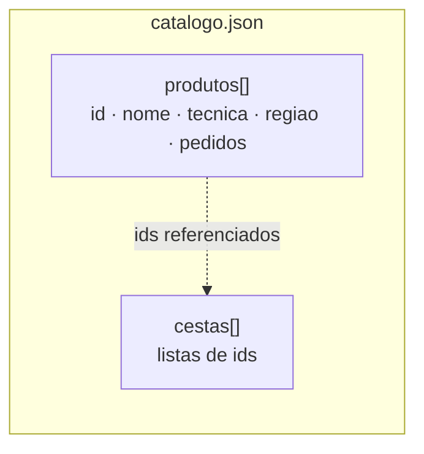
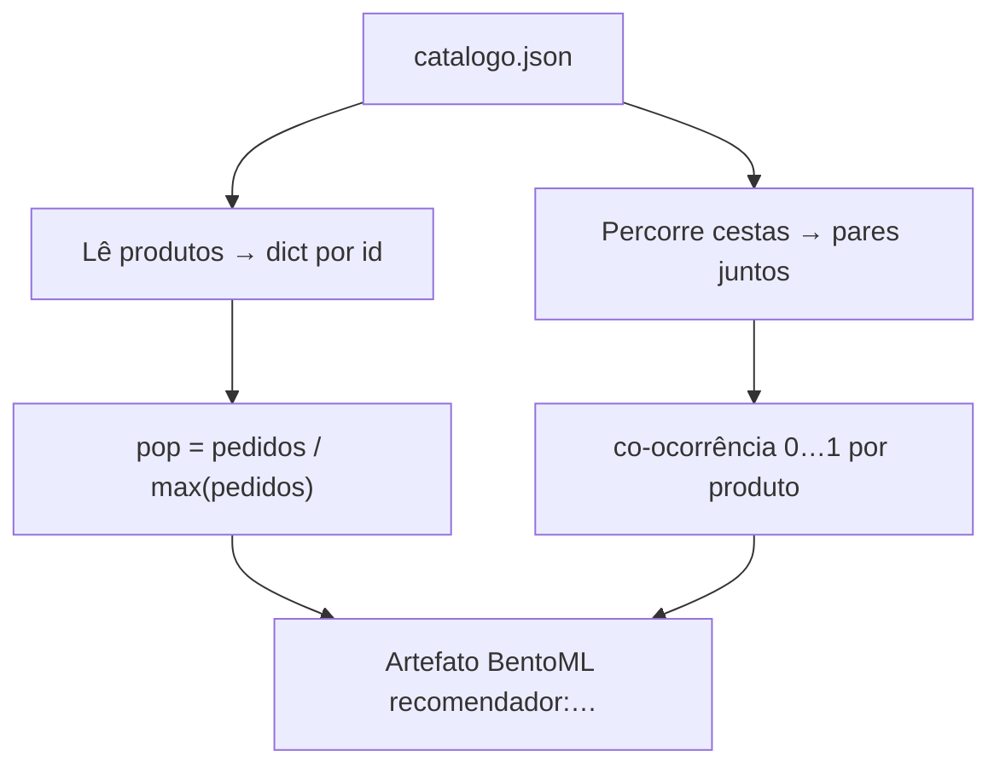

# Dados (`dados/`)

Catálogo de exemplo usado pelo treino e pelo serviço. Um único arquivo:
[`catalogo.json`](catalogo.json).

## Por que este conjunto existe

O marketplace da aula precisa de produtos com **técnica**, **região** e um sinal de
**demanda** (`pedidos`), mais algumas **cestas** (compras de exemplo) para medir
“aparecem juntos”. O JSON é pequeno de propósito: dá para conferir as contas à mão e
ainda assim exercitar a API de ponta a ponta.

## Forma do arquivo

```json
{
  "produtos": [ { "id", "nome", "tecnica", "regiao", "pedidos" }, … ],
  "cestas": [ [ "p01", "p02", … ], … ]
}
```



| Campo | Onde | Significado |
| --- | --- | --- |
| `id` | produto | Chave estável (`p01` … `p12`); é o que a API recebe em `produto_na_pagina` |
| `nome` | produto | Rótulo legível na vitrine e na resposta JSON |
| `tecnica` | produto | Família artesanal: `ceramica`, `renda`, `xilogravura`, `cestaria` |
| `regiao` | produto | Polo (Tracunhaém, Alto do Moura, Comunidade do Pilar, …) |
| `pedidos` | produto | Contagem de demanda; vira popularidade no treino |
| `cestas` | raiz | Listas de ids que “saíram juntos”; alimentam a co-ocorrência |

## Conteúdo atual (resumo)

| Técnica | Quantidade | Exemplos |
| --- | ---: | --- |
| ceramica | 3 | Jarro, prato esmaltado, boneca de barro (Tracunhaém) |
| renda | 3 | Rendeira, toalha, caminho de mesa (Alto do Moura) |
| xilogravura | 3 | Xilo, cordel, quadro (Comunidade do Pilar) |
| cestaria | 3 | Cesto, bolsa, sousplat (Pilar / Alto do Moura) |

Há **12 produtos** e **10 cestas**. O produto com mais pedidos é o jarro `p01` (42);
ele é o **produto da página** do exemplo em
[`../material/calculos-trabalhados.md`](../material/calculos-trabalhados.md).

## Como o treino usa estes dados



1. Lê `produtos` → dicionário por `id`.
2. `pedidos_brutos = pedidos`; `pop = pedidos_brutos / max`.
3. Percorre `cestas` → `conta` → `cooc` (pares na mesma cesta).
4. Grava tudo no artefato BentoML (`recomendador:…`).

Mudou o JSON? Rode `just treino` de novo na raiz do repositório.

---

## Montar o mesmo formato a partir de um marketplace real

O `catalogo.json` da aula é **sintético**. Em um marketplace de verdade (Postgres,
MySQL, export CSV da WEB ou do banco), você coleta as mesmas peças e **escreve o
mesmo formato**. O serviço e o treino não mudam — só o arquivo em `dados/`.

### O que você precisa extrair

| Peça no JSON | Origem típica na loja | Observação |
| --- | --- | --- |
| `produtos[].id` | PK do produto (UUID ou inteiro) | Pode manter o UUID; a API só exige string estável |
| `produtos[].nome` | Título / nome de vitrine | Texto curto |
| `produtos[].tecnica` | Categoria, tag ou atributo “técnica” | **Um** rótulo por produto, em minúsculas sem acento se quiser alinhar ao exemplo |
| `produtos[].regiao` | Região do artesão / polo | Pode ir vazio `""` se a loja ainda não tiver |
| `produtos[].pedidos` | Contagem de linhas de pedido (ou vendas) daquele produto | Inteiro ≥ 0; janela de tempo: escolha uma (ex.: últimos 90 dias) e documente |
| `cestas[]` | Cada **pedido concluído** → lista dos `product_id` daquele pedido | Pedidos com um único item geram cesta de um elemento (não ajudam co-ocorrência, mas são válidos) |

### Passo a passo

1. **Fixe o período.** Ex.: “pedidos pagos de 01/07 a 30/09”. Popularidade e cestas
   devem usar a **mesma** janela.
2. **Exporte o catálogo.** Uma linha por produto com id, nome, técnica, região.
   - Se a loja só tem “categoria” genérica, mapeie categoria → `tecnica` numa tabela
     auxiliar (planilha basta) e grave o rótulo final no JSON.
3. **Conte pedidos por produto.**  
   `pedidos(produto) = número de vezes que o id aparece em itens de pedido no período`  
   (ou soma de quantidades, se a loja vende em lote — escolha uma regra e mantenha).
4. **Monte as cestas.** Para cada `order_id` no período:

   ```text
   cesta = lista distinta dos product_id daquele pedido
   ```

   Ignore pedidos cancelados/reembolsados. Ordem dos ids dentro da lista **não**
   importa.
5. **Escreva o JSON** com exatamente duas chaves de raiz: `produtos` e `cestas`.
6. **Valide** (checklist abaixo) e substitua `dados/catalogo.json`.
7. Na raiz: `just treino` e reinicie o `just serve`.

### Exemplos de consulta (SQL ilustrativo)

Ajuste nomes de tabela/coluna ao schema do banco.

```sql
-- Catálogo (+ demanda no período)
SELECT
  p.id::text          AS id,
  p.nome              AS nome,
  lower(p.tecnica)    AS tecnica,
  coalesce(p.regiao, '') AS regiao,
  count(oi.id)::int   AS pedidos
FROM produtos p
LEFT JOIN order_items oi ON oi.product_id = p.id
LEFT JOIN orders o ON o.id = oi.order_id
  AND o.status = 'pago'
  AND o.criado_em >= DATE '2026-07-01'
  AND o.criado_em <  DATE '2026-10-01'
GROUP BY p.id, p.nome, p.tecnica, p.regiao;
```

```sql
-- Cestas: um array de product_id por pedido
SELECT
  o.id AS order_id,
  array_agg(DISTINCT oi.product_id::text) AS ids
FROM orders o
JOIN order_items oi ON oi.order_id = o.id
WHERE o.status = 'pago'
  AND o.criado_em >= DATE '2026-07-01'
  AND o.criado_em <  DATE '2026-10-01'
GROUP BY o.id;
```

Se a fonte for **CSV** (export do admin):

1. `produtos.csv` → colunas `id,nome,tecnica,regiao,pedidos` (ou calcule `pedidos` noutro arquivo e faça o join).
2. `itens_pedido.csv` → colunas `order_id,product_id`.
3. Agrupe por `order_id` para formar cada entrada de `cestas`.

### Checklist antes de `just treino`

- [ ] Todo id em `cestas` existe em `produtos`.
- [ ] Todo `id` de produto é único.
- [ ] `pedidos` é inteiro ≥ 0; pelo menos um produto tem `pedidos > 0` (senão a
      normalização quebra ou fica sem sentido).
- [ ] `tecnica` e `regiao` são strings (mesmo que vazias).
- [ ] Há **algumas** cestas com **≥ 2** produtos — senão a co-ocorrência fica quase toda zero.
- [ ] Encoding UTF-8; JSON válido (`python -m json.tool dados/catalogo.json`).

### Limites ao usar loja real

- LGPD: exporte **só** ids de produto e agregados; não coloque nome/e-mail de cliente no JSON.
- Catálogo enorme: o baseline carrega tudo em memória — comece com um recorte (categoria ou topo-N pedidos).
- Estoque e preço **não** entram neste formato; a API atual não os usa.

## Limites do arquivo de exemplo da aula

- Demanda e cestas do `catalogo.json` commitado são **inventadas para a aula**.
- `regiao` aparece na resposta da API; a ordenação deste baseline não a usa.
- Não há usuários, timestamps nem estoque: só catálogo + cestas.
