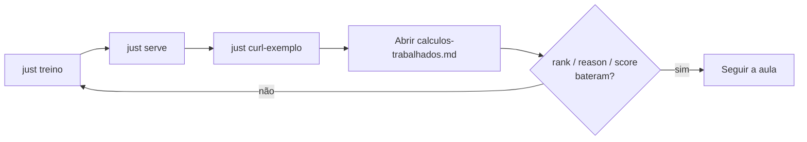

# Material (`material/`)

Textos de apoio à aula que **não** sobem com o serviço — são para ler e projetar
junto com o código.

| Arquivo | Conteúdo |
| --- | --- |
| [`calculos-trabalhados.md`](calculos-trabalhados.md) | Contas passo a passo do exemplo do jarro (`p01`), alinhadas ao que `just curl-exemplo` deve devolver |

## Como usar na sala

1. Suba a API (`just treino` · `just serve` na raiz).
2. Rode `just curl-exemplo`.
3. Compare **rank**, `reason` e score com a tabela final do markdown.
4. Se divergir, o catálogo ou o artefato ficaram desatualizados — `just treino` de novo.
