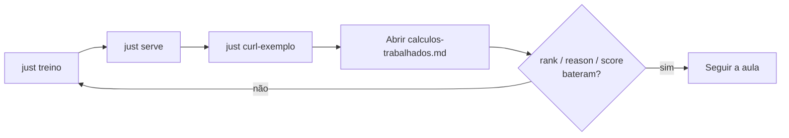

# Material (`material/`)

Depois que o `POST /recomendar` devolve JSON, a aula ainda precisa de um lugar
para **abrir as contas no papel**: popularidade, co-ocorrência, score e o
complemento por popularidade do exemplo do jarro. Esta pasta é esse caderno —
fica ao lado do código, para projetar e conferir.

Textos de apoio à aula que **não** sobem com o serviço — são para ler e projetar
junto com o código.

| Arquivo | Conteúdo |
| --- | --- |
| [`calculos-trabalhados.md`](calculos-trabalhados.md) | Contas passo a passo do exemplo do jarro (`p01`), alinhadas ao que `just curl-exemplo` deve devolver |

## Como usar na sala

O fio é o dos dois pipelines: primeiro o treino grava o artefato; depois a
inferência responde; só então o markdown valida rank, `reason` e score. Se as
contas baterem, a métrica da aula (auditabilidade) ficou satisfeita para o
exemplo `p01`.

1. Suba a API (`just treino` · `just serve` na raiz).
2. Rode `just curl-exemplo`.
3. Compare **rank**, `reason` e score com a tabela final do markdown.
4. Se divergir, o catálogo ou o artefato ficaram desatualizados — `just treino` de novo.

O catálogo que alimenta essas contas está em
[`../dados/README.md`](../dados/README.md). O arco projetado na tela segue em
[`../slides/README.md`](../slides/README.md).
