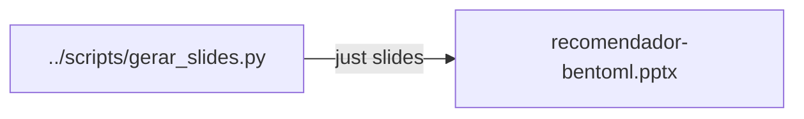

# Slides (`slides/`)

Apresentação curta da aula (gerada por código). Os diagramas da sessão estão
**dentro do deck**, não neste README.

| Arquivo | Conteúdo |
| --- | --- |
| [`recomendador-bentoml.pptx`](recomendador-bentoml.pptx) | Objetivo, fluxo↔código, `treino.py`, exemplo do jarro, código, mapa IA |



Regenerar:

```bash
just slides
```

Arquivos de lock temporários do LibreOffice (`.~lock.…`) não entram no git.
