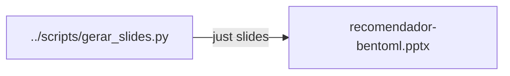

# Slides (`slides/`)

Esta pasta guarda o deck que a turma vê na projeção. A história começa na
**vitrine** (catálogo invisível sem sugestão), passa por **métricas** e pela
**cesta de mercado**, separa **treino** de **inferência**, demonstra o baseline
com BentoML e só então apresenta evoluções — **uma ideia de variante por vez**
no fio da aula.

Deck gerado por [`../scripts/gerar_slides.py`](../scripts/gerar_slides.py).

**Arco:** cena da vitrine → pacotes → sinais → **métricas (prosa)** → **cesta de
mercado (prosa + estrutura)** → métricas nos dados → **treino / inferência** →
API e demo → literatura → variantes → empacote.

| Arquivo | Conteúdo |
| --- | --- |
| [`recomendador-bentoml.pptx`](recomendador-bentoml.pptx) | 19 slides — ver arco abaixo |

### Arco (19 slides)

Cada bloco responde a uma pergunta da sala. Os números batem com o rodapé do
`.pptx` (`cena → métricas → cesta → pipelines`).

| # | Título |
| ---: | --- |
| 1 | Recomendador no BentoML |
| 2 | Pacotes da aula |
| 3 | Sinais que a loja observa |
| 4 | Métricas do projeto |
| 5 | Cesta de mercado |
| 6 | Métricas nos dados |
| 7 | Dois pipelines — treino e inferência |
| 8 | Só o treino (offline) |
| 9 | Só a inferência (online) |
| 10 | Artefato no meio |
| 11 | Algoritmo na inferência |
| 12 | API — POST /recomendar |
| 13 | Como subir |
| 14 | Exemplo p01 |
| 15 | Nomes no código |
| 16 | Literatura de recomendação |
| 17 | Data Science → Machine Learning |
| 18 | Catálogo de variantes |
| 19 | Empacote — inferência portátil |



### Como encaixa no restante do repo

| Momento da aula | Onde aprofundar |
| --- | --- |
| Sinais e catálogo | [`../dados/README.md`](../dados/README.md) |
| Contas do jarro `p01` | [`../material/README.md`](../material/README.md) |
| Regenerar o deck | [`../scripts/README.md`](../scripts/README.md) · `just slides` |
| Sistema completo (HTTP, fórmula, container) | [`../README.md`](../README.md) |

Regenerar:

```bash
just slides
```

Arquivos de lock do LibreOffice (`.~lock.…`) não entram no git.
