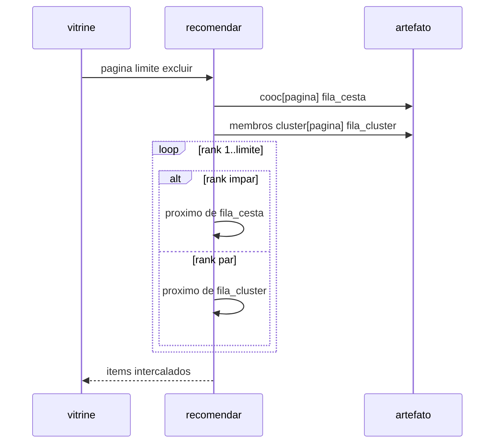

# Variante clustering (cesta ⊕ cluster)

Pasta irmã do baseline em [`../`](../). Monta a lista **intercalando** dois sinais:

| Rank | Fonte | `reason` |
| ---: | --- | --- |
| 1, 3, 5, … | co-ocorrência nas `cestas` com o produto da página | `cesta` |
| 2, 4, 6, … | mesmo **cluster hierárquico** do produto da página | `cluster` |

| | Baseline (`../`) | Esta variante |
| --- | --- | --- |
| Técnica de grupo | filtro manual por `tecnica` | agglomerative (ward), `n_clusters=4` |
| Lista | score único ordenado | intercalação estrita cesta / cluster |
| Artefato | `recomendador:…` | `recomendador-cluster:…` |
| Porta | 3000 | **3002** |

## Subir

```bash
just treino
just serve
just curl-exemplo   # p07 → reasons cesta, cluster, cesta, cluster
```

Swagger: `http://127.0.0.1:3002`.

## Cluster hierárquico (o desenho)

No treino, cada produto vira um vetor: one-hot de `tecnica` + one-hot de `regiao` +
`pedidos` padronizado. O linkage **ward** produz a árvore; cortamos em 4 grupos.
O dendrograma gerado fica em:


## Intercalação

```text
# Variáveis:
#   pagina, limite, excluir, usados
#   fila_cesta, fila_cluster, escolhidos, rank, src, pid

fila_cesta   ← ids ordenados por cooc[pagina] desc
fila_cluster ← ids do mesmo cluster que pagina, por pop desc
usados ← {pagina} ∪ excluir
escolhidos ← []
rank ← 1
enquanto |escolhidos| < limite:
    src ← cesta se rank ímpar senão cluster
    pid ← próximo de fila_src fora de usados
    se pid é nulo: pid ← próximo da outra fila fora de usados
    se pid é nulo: pare
    usados ← usados ∪ {pid}
    escolhidos.append(pid com reason da fila que forneceu)
    rank ← rank + 1
```

`intercalacao_completa` no JSON fica `true` só se cada vaga veio da fonte preferida
daquele rank.



## Mapa de arquivos

| Arquivo | Papel |
| --- | --- |
| [`dados/catalogo.json`](dados/catalogo.json) | produtos + cestas (cópia do baseline) |
| [`treino.py`](treino.py) | pop, cooc, AgglomerativeClustering, dendrograma, pickle |
| [`service.py`](service.py) | `RecomendadorCluster.recomendar` |
| [`material/dendrograma.png`](material/dendrograma.png) | figura gerada no `just treino` |
| [`justfile`](justfile) | treino / serve :3002 / curl |
