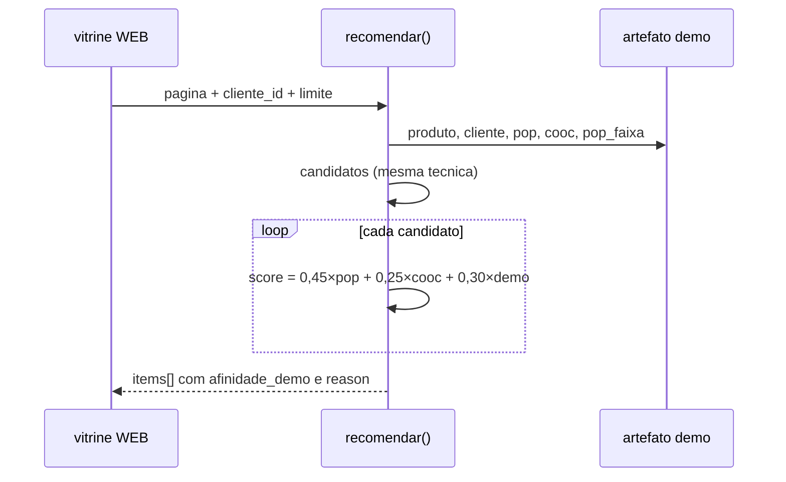

# Variante demográfica

O baseline da raiz já responde à pergunta da vitrine: *dado o produto da página,
quais outros sugerir?* Nesta pasta a aula dá um passo a mais — **uma pergunta
nova, sozinha**:

> E se soubermos *quem* está olhando o jarro?

O mesmo HTTP, o mesmo papel de treino e inferência, e um sinal extra: perfil do
cliente (faixa etária, preferências) e compras de exemplo por pessoa. Enquanto
você estiver aqui, o foco é só esse sinal.

Pasta irmã do baseline em [`../`](../). Mesma ideia (técnica + popularidade +
co-ocorrência + BentoML), **mais** um sinal de perfil do cliente.

| | Baseline (`../`) | Esta variante |
| --- | --- | --- |
| Entrada | só `produto_na_pagina` | `produto_na_pagina` + `cliente_id` (opcional) |
| Dados extras | — | `clientes[]`, `compras[]` |
| Artefato BentoML | `recomendador:…` | `recomendador-demo:…` (não sobrescreve o baseline) |
| Score (mesma técnica) | `0,7×pop + 0,3×cooc` | `0,45×pop + 0,25×cooc + 0,30×demo` |

`demo` mistura (a) preferências declaradas (`tecnicas_preferidas`, `polos_interesse`)
e (b) popularidade do produto **dentro da faixa etária** do cliente, medida nas
`compras` de exemplo.

## Subir

Os dois pipelines continuam separados: `just treino` grava
`recomendador-demo:…`; `just serve` sobe a inferência na porta **3001**. O
ambiente Python (`uv` / `.venv`) fica na raiz do repositório.

Na raiz do repositório o `uv` / `.venv` já existem. Desta pasta:

```bash
just treino
just serve
```

Swagger em `http://127.0.0.1:3001` (porta **3001** para não brigar com o baseline
na 3000).

```bash
just curl-com-cliente
just curl-sem-cliente
```

## O que entra no JSON

A cena da feira ganha rostos sintéticos: além do catálogo e das cestas, o arquivo
traz *quem* compra e *o que* cada perfil já levou. Detalhe campo a campo em
[`dados/README.md`](dados/README.md).

Além de `produtos` e `cestas` (iguais à ideia do baseline):

```json
"clientes": [
  {
    "id": "u01",
    "faixa_etaria": "25-34",
    "regiao_cliente": "Recife",
    "tecnicas_preferidas": ["ceramica", "renda"],
    "polos_interesse": ["Tracunhaém", "Alto do Moura"]
  }
],
"compras": [
  {"cliente_id": "u01", "itens": ["p01", "p02"]}
]
```

Detalhe dos campos: [`dados/README.md`](dados/README.md).

## Como a afinidade demográfica é calculada

Na inferência, a nota `demo` junta o que a pessoa *declara* gostar com o que a
faixa etária dela costuma pedir nas compras de exemplo. O treino só prepara
`pop_faixa` e o mapa de clientes; o score abaixo roda a cada `POST /recomendar`.

```text
# Variáveis:
#   cliente     — registro do clientes[] (ou None)
#   produto     — registro do produtos[]
#   pop_faixa   — mapa faixa_etaria → (id → 0…1) gravado no treino
#   tecnica_ok  — 1 se produto.tecnica ∈ cliente.tecnicas_preferidas
#   polo_ok     — 1 se produto.regiao ∈ cliente.polos_interesse
#   declarado   — média de tecnica_ok e polo_ok
#   na_faixa    — pop_faixa[cliente.faixa_etaria][produto.id]
#   demo        — afinidade final 0…1

tecnica_ok ← 1 se produto.tecnica ∈ preferidas senão 0
polo_ok    ← 1 se produto.regiao ∈ polos_interesse senão 0
declarado  ← 0,5 × tecnica_ok + 0,5 × polo_ok
na_faixa   ← pop_faixa[faixa_etaria][id]   # 0 se a faixa não comprou esse id
demo       ← 0,5 × declarado + 0,5 × na_faixa
```

Sem `cliente_id`, `demo = 0` e o serviço se comporta como um primo do baseline
(pesos diferentes; motivo `mesma_tecnica` / `complemento_popularidade`).



## Relação com o baseline e com ML

Isto **ainda** é regra + agregados (ciência de dados + serviço), não um modelo
treinado. O perfil demográfico é o próximo degrau pedagógico antes de rotular
pares `(página, candidato, cliente)` — ver o mapa Microsoft Learn no
[`../README.md`](../README.md#ds-para-ml-microsoft-learn).

O contrato HTTP permanece familiar (`POST /recomendar`); muda a origem de parte
do score e o campo opcional `cliente_id`. Para empacotar esta inferência em
imagem OCI, use `just imagem` e `just serve-container` **nesta** pasta (tag
`recomendador-demo:aula`).

## Mapa de arquivos

| Arquivo | Papel |
| --- | --- |
| [`dados/catalogo.json`](dados/catalogo.json) | produtos, cestas, clientes, compras |
| [`treino.py`](treino.py) | pop, cooc, pop_faixa → `recomendador-demo` |
| [`service.py`](service.py) | `RecomendadorDemo.recomendar` |
| [`justfile`](justfile) | `treino`, `serve` (porta 3001), curls |
| [`bentofile.yaml`](bentofile.yaml) | empacote Bento / container desta variante |
